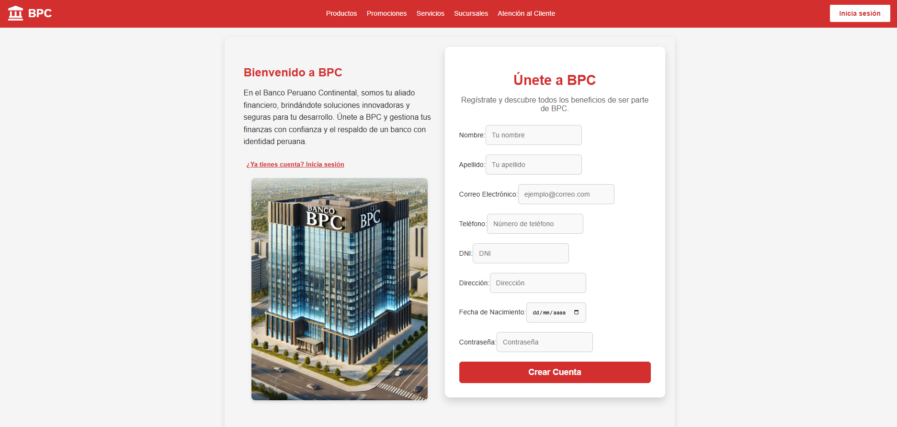
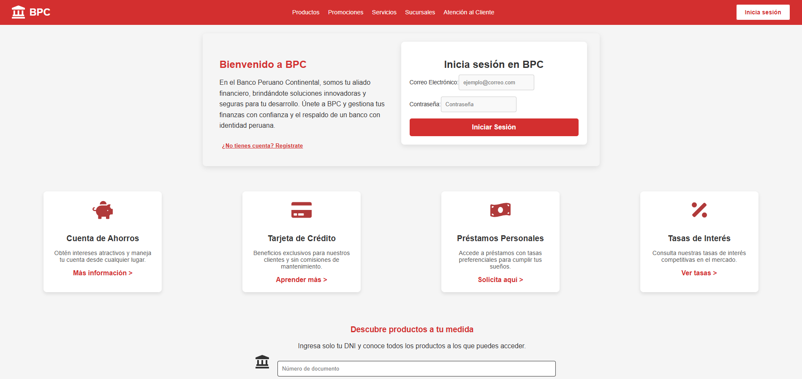
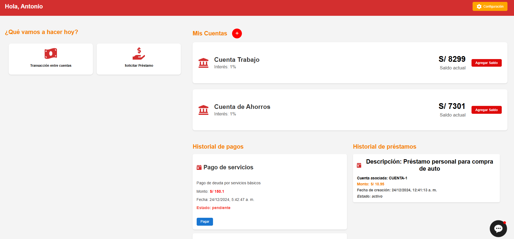
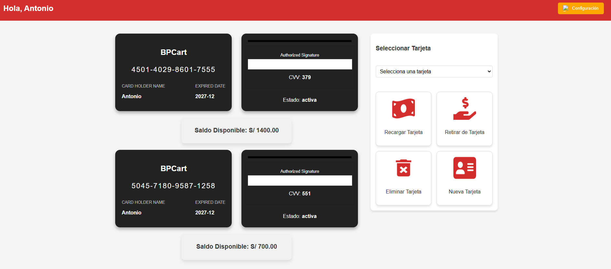

# SIMULADOR BANCO BPC FRONTEND 🌐

En el Banco Peruano Continental, somos tu aliado financiero, brindándote soluciones innovadoras y seguras para tu desarrollo. 💡💳  
Únete a BPC y gestiona tus finanzas con confianza y el respaldo de un banco con identidad peruana. 🇵🇪

## Tecnología utilizada 🔧
Para este proyecto utilizamos tecnologías modernas como:

- JavaScript 🎮
- HTML 📄
- CSS 🎨
- React + Vite ⚛️🚀
- Axios (para las peticiones HTTP) 📡

## Registro del Usuario 📝
A continuación se muestra una imagen representativa del proceso de registro de usuario:

- 

## Inicio de sesión del usuario 🔑
El proceso de inicio de sesión para los usuarios es sencillo y seguro:

- 

## Interfaz de usuario 🖥️
La interfaz de usuario está diseñada para ser intuitiva y fácil de usar:

- 

## Ver mis cuentas asociadas a mi tarjeta 💳
Los usuarios pueden ver las cuentas asociadas a sus tarjetas de forma clara y detallada:

- 

## Descubre más de nuestra página interactiva en el siguiente enlace 🌍
Visita el siguiente enlace para explorar la página interactiva, que está alojada en un bucket S3:

**Web**: [http://banco-bpc-site.s3-website-us-east-1.amazonaws.com](http://banco-bpc-site.s3-website-us-east-1.amazonaws.com)
